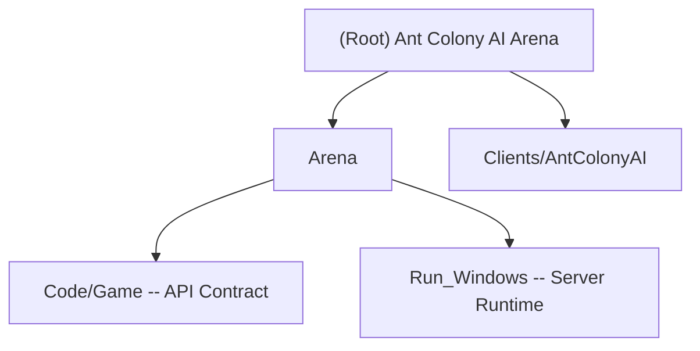

# Ant Colony AI Arena -- Project Context

## Changelog

| Date       | Action  | Notes                                      |
|------------|---------|--------------------------------------------|
| 2026-04-05 | Created | Initial full scan; 100% source file coverage |

## Project Vision

"Formicidae" -- a C++ DLL plugin (AI_YuWeiTseng.dll) for the AntArena2 competition at SMU Guildhall. The DLL is loaded by the arena server EXE at runtime and controls a colony of ants in a turn-based, tile-based arena. The goal is to survive, gather food, and outcompete other player AIs.

## Architecture Overview

The project follows a layered architecture with strict separation between the arena's EXE-thread callbacks and the AI's worker-thread logic, connected by lock-free triple buffers.

```
Arena EXE (AntArena2_x64.exe)
    |
    | LoadLibrary / GetProcAddress
    v
DLL Export Layer (ArenaPlayerImplementation.cpp)
    |  ReceiveTurnState -> TripleBuffer<State> -> WorkerLoop reads
    |  TurnOrderRequest <- TripleBuffer<Orders> <- WorkerLoop writes
    v
Colony (orchestrator)
    |--- GameMap        (tile grid, fog-of-war, BFS pathfinding, HeatMap)
    |--- AntManager     (ant pool, role assignment, order generation)
    |--- DebugRenderer  (debug draw/log via DebugInterface)
```

Key threading model: the arena calls `ReceiveTurnState` and `TurnOrderRequest` on its own thread (must return sub-1ms). The AI runs on worker thread 0 via `PlayerThreadEntry`. Data flows through `TripleBuffer<T>` (triple-buffered producer/consumer with mutex + condition_variable).

## Module Structure Diagram



## Module Index

| Module | Path | Language | Description |
|--------|------|----------|-------------|
| AntColonyAI | `Clients/AntColonyAI/` | C++17 | Our AI DLL source -- 8 cpp, 9 headers |
| Arena API | `Arena/Code/Game/` | C++ | Read-only API contract (`ArenaPlayerInterface.hpp`) |
| Arena Runtime | `Arena/Run_Windows/` | Binary + XML | Server EXE, match/map/agent configs, opponent DLLs |

## Building and Running

- Toolchain: MSVC v143 (Visual Studio 2022), Windows SDK 10.0, C++17
- Target: x64 DynamicLibrary (DLL)
- Output name: `AI_YuWeiTseng.dll`
- Solution: `Clients/AntColonyAI/AntColonyAI.sln`
- Post-build: auto-copies DLL to `Arena/Run_Windows/Players/`
- To run: launch `Arena/Run_Windows/AntArena2_x64.exe` (F5 from VS with debugger attached)
- Compiler flags: `/W3 /WX` (warnings as errors) on x64 configs, `/SDL`, conformance mode

## Testing Strategy

No automated test framework. Testing is done by running the arena EXE against benchmark and opponent DLLs:
- `Arena/Run_Windows/Storehouse/AI_Benchmark.dll` -- baseline opponent
- `Arena/Run_Windows/Storehouse/AI_Demo.dll` -- demo opponent
- `Arena/Run_Windows/Storehouse/Faculty/` -- faculty AIs (Butler, Forseth)
- `Arena/Run_Windows/Storehouse/HallOfFame/` -- top student AIs from past cohorts
- Match configs in `Arena/Run_Windows/Data/MatchDefinitions.xml` (Default, Debug, Fast, Final)
- Map configs in `Arena/Run_Windows/Data/MapDefinitions.xml` (10 map types, 32-200 tiles wide)
- Debug keys at runtime: P=play/pause, SPACE=step, 1-9=player debug draw, R=restart

## Coding Standards

- `#pragma once` for all headers
- PascalCase for classes and methods
- `m_camelCase` for member variables (m_ prefix required)
- English comments only
- Zero warnings: `/WX` (treat warnings as errors) enabled on x64 Debug and Release
- No heap allocations beyond initial setup (fixed-size arrays throughout)
- Movement/dig validation reads from `AgentTypeInfo` at runtime -- never hardcoded tile rules
- Water tiles are always treated as impassable (A5 restriction)

## AI Usage Guidelines

- `ArenaPlayerInterface.hpp` is read-only -- never modify it
- All source lives in `Clients/AntColonyAI/` -- only modify files there
- The DLL export functions in `ArenaPlayerImplementation.cpp` must remain thin wrappers
- `TripleBuffer` is the only safe way to pass data between EXE thread and AI thread
- `ReceiveTurnState` and `TurnOrderRequest` must return in sub-1ms (no BFS, no heavy work)
- All heavy AI logic runs on worker thread 0 inside `Colony::WorkerLoop`
- Agent type stats come from `AgentTypeInfo` in `StartupInfo` -- do not hardcode costs/penalties
- The `DebugInterface` pointer is only valid during the match lifetime
